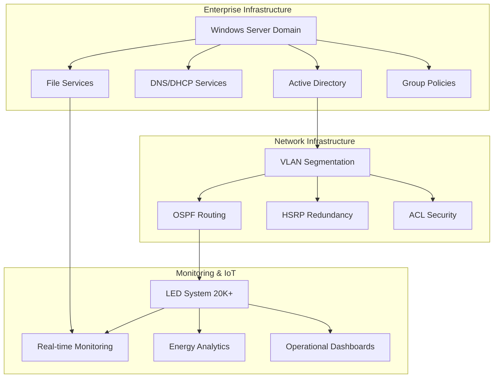

# 🚢 Smart Cruise Vessel IT Simulation

<div align="center">

**Integrated IT & Network Operations for Modern Maritime Infrastructure**

[](https://github.com/yourusername/smart-cruise-vessel-it-simulation)
[](https://github.com/yourusername/smart-cruise-vessel-it-simulation)
[](https://github.com/yourusername/smart-cruise-vessel-it-simulation)
[](https://github.com/yourusername/smart-cruise-vessel-it-simulation)

*A production-grade simulation of enterprise IT systems powering next-generation cruise vessels. From Active Directory domains to IoT monitoring dashboards, this project demonstrates the full spectrum of enterprise infrastructure capabilities.*

</div>

---

## 🎯 What Makes This Special

| 🚀 Enterprise Architecture | 🌐 Advanced Networking | 📊 IoT & Analytics | 🔧 Infrastructure as Code |
|:---:|:---:|:---:|:---:|
| Complete Windows Server domain with multi-department user management, group policies, DNS, DHCP, and enterprise file services | Complex VLAN segmentation with OSPF routing, HSRP redundancy, ACL security, and port-to-sea mode switching | Real-time monitoring of 20,000+ LED nodes with energy analytics, predictive maintenance, and operational dashboards | Complete automation suite with PowerShell scripts for Windows administration and Python for data simulation |

---

## 📊 Project Metrics

| Metric | Value | Description |
|:---:|:---:|:---|
| 📈 **Completion** | `35%` | Foundation modules ready for implementation |
| 🖥️ **IoT Nodes** | `20,000+` | LED lighting system simulation |
| ⚙️ **Automation Scripts** | `8` | PowerShell & Python infrastructure as code |
| 🏗️ **Enterprise Modules** | `5` | Complete IT infrastructure stack |
| 📚 **Documentation** | `100%` | Professional architecture & implementation guides |

---

## 🏗️ Architecture Overview



---

## 🛠️ Technology Stack

### 🖥️ Infrastructure & Operating Systems
- **Windows Server 2019/2022** - Domain Controllers, File Services, Enterprise Management
- **Active Directory** - Identity Management, Group Policies, Security
- **VMware/Hyper-V** - Virtualization Platform, Infrastructure Scaling

### 🌐 Networking & Security
- **Cisco IOS** - Router/switch configurations
- **GNS3/Packet Tracer** - Network Simulation, Topology Design
- **VLANs & OSPF** - Network Segmentation, Dynamic Routing
- **HSRP/VRRP** - High Availability, Gateway Redundancy

### 📊 Monitoring & Analytics
- **Grafana + Prometheus** - Dashboards, Metrics Collection, Visualization
- **Python** - IoT Data Generation, Analytics Processing
- **PowerShell** - Automation Scripts, Windows Administration

---

## 📁 **Project Structure**

```
RCG/
├── 📂 docs/
│   ├── 📂 architecture/          # System architecture docs
│   │   ├── windows-infrastructure.md
│   │   ├── network-architecture.md
│   │   └── monitoring-architecture.md
│   ├── 📂 procedures/           # Implementation guides
│   │   ├── dns-dhcp-configuration.md
│   │   ├── group-policy-configuration.md
│   │   └── network-setup-guide.md
│   └── 📂 scenarios/            # Incident scenarios
├── 🖥️ windows-server/
│   ├── 📂 scripts/              # 8 PowerShell automation scripts
│   ├── 📂 screenshots/          # Implementation screenshots
│   └── 📄 README.md             # Implementation guide
├── 🌐 network-simulation/
│   ├── 📂 configs/              # Router/switch configurations
│   └── 📄 README.md             # Network setup guide
├── 📊 monitoring-dashboard/
│   ├── 📂 data-simulation-scripts/
│   └── 📄 README.md             # Monitoring guide
└── 📄 README.md                 # This file
```

---

## 📈 Development Progress

### Module Status Overview

| Module | Status | Progress | Key Deliverables |
|:---:|:---:|:---:|:---|
| 🖥️ Windows Infrastructure | ✅ Foundation Complete | 60% | AD, DNS, DHCP, File Services, GPOs |
| 🌐 Network Architecture | 🚧 Foundation Started | 40% | VLAN configs, OSPF routing, ACLs |
| 📊 IoT Monitoring | 🚧 Foundation Started | 20% | LED simulation, data generation |
| 🎯 Incident Response | 📅 Planned | 0% | Scenarios & troubleshooting |
| 📚 Documentation | 📅 Planned | 0% | Final presentation materials |

### Progress Visualization

```
🚢 Windows Infrastructure     ████████░░░░░░░░ 60%
🌐 Network Architecture       ████░░░░░░░░░░░░ 40%
📊 IoT Monitoring            ██░░░░░░░░░░░░░░ 20%
🎯 Incident Response         ░░░░░░░░░░░░░░░░ 0%
📚 Documentation             ░░░░░░░░░░░░░░░░ 0%
```

---

## 🚀 Quick Start

### Step 1: Choose Your Path

| Path | Best For | Time Required | Complexity |
|:---:|:---:|:---:|:---:|
| 🏗️ Architecture Review | Understanding design | 30 mins | Low |
| ⚙️ Windows Implementation | Hands-on infrastructure | 4-6 hours | Medium |
| 🌐 Network Setup | Network engineering | 3-4 hours | High |
| 📊 Monitoring Build | Data & analytics | 2-3 hours | Medium |

### Step 2: Get Started

```bash
# Clone the repository
git clone https://github.com/yourusername/smart-cruise-vessel-it-simulation.git
cd smart-cruise-vessel-it-simulation

# Review architecture
cat docs/architecture/windows-infrastructure.md

# Start implementation
cd windows-server && cat README.md
```

---

## 🎯 What You'll Learn

| Skill Category | Technologies | Real-World Application |
|:---:|:---:|:---:|
| 🏢 Enterprise IT | Windows Server, AD, GPOs | Corporate IT administration |
| 🌐 Network Engineering | VLANs, OSPF, HSRP | Enterprise network design |
| 📊 Infrastructure Monitoring | Grafana, Prometheus, Python | DevOps & SRE roles |
| 🔧 Automation | PowerShell, Python scripting | Infrastructure as Code |
| 📚 Documentation | Technical writing, diagrams | IT consulting & architecture |

---

## 📈 Success Metrics

### Technical Excellence
- ✅ **Infrastructure as Code**: 8 automated deployment scripts
- ✅ **Production Architecture**: Enterprise-grade system design
- ✅ **Scalability**: 20K+ IoT node simulation capability
- ✅ **Security**: Multi-layer security implementation

### Portfolio Impact
- ✅ **Professional Documentation**: Comprehensive technical guides
- ✅ **Visual Assets**: Architecture diagrams and implementation screenshots
- ✅ **Industry Relevance**: Maritime IT focus with enterprise applications
- ✅ **Demonstrated Skills**: Full-stack infrastructure expertise

---

## 🎯 Call to Action

### 🚀 Ready to Explore Enterprise Infrastructure?

[](docs/architecture/windows-infrastructure.md)
[](windows-server/README.md)
[](network-simulation/README.md)

**This project represents the kind of complex, mission-critical infrastructure that powers modern enterprises. Every component is designed with production environments in mind and can be directly applied to real-world scenarios.**

---

## 🤝 Contributing

**This is a portfolio project showcasing enterprise infrastructure capabilities. Suggestions and feedback are welcome!**

[](https://github.com/yourusername/smart-cruise-vessel-it-simulation/issues)
[](https://github.com/yourusername/smart-cruise-vessel-it-simulation/discussions)

---

## 📄 License

[](LICENSE)

---

<div align="center">

**Built with ❤️ for enterprise IT excellence**

</div>
